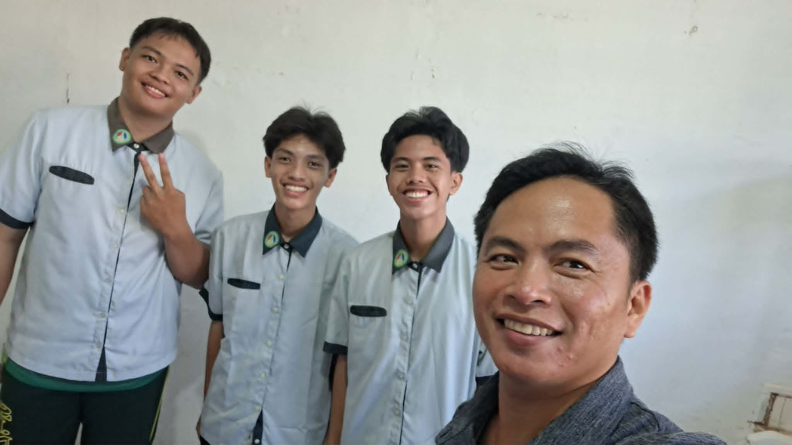
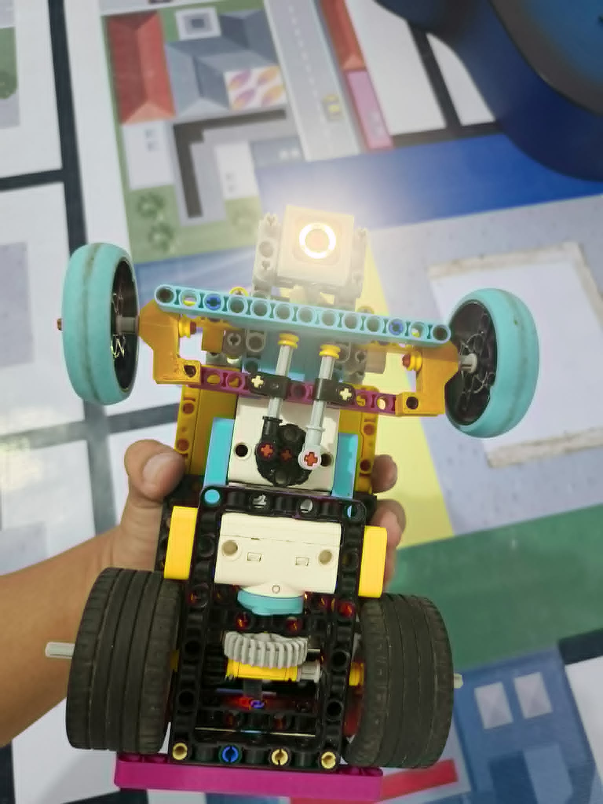
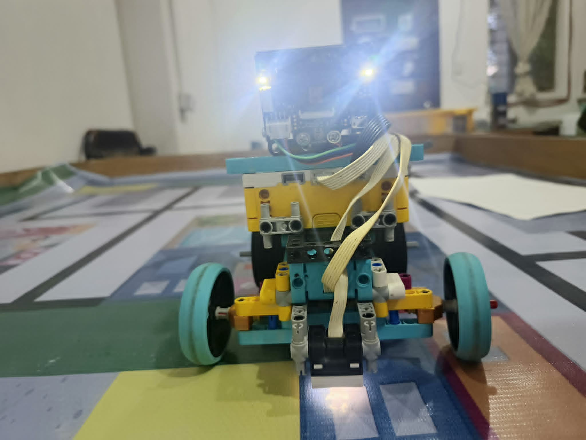
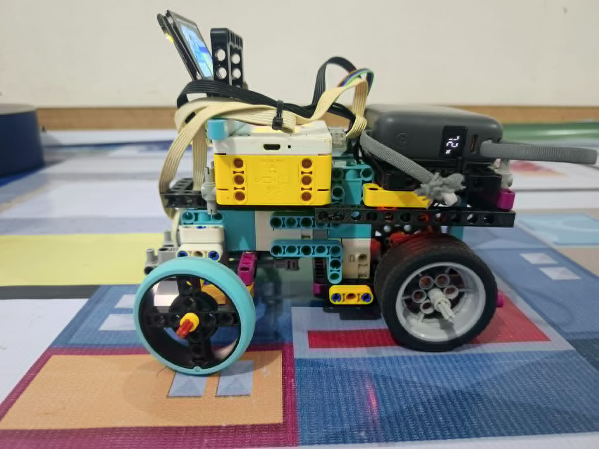
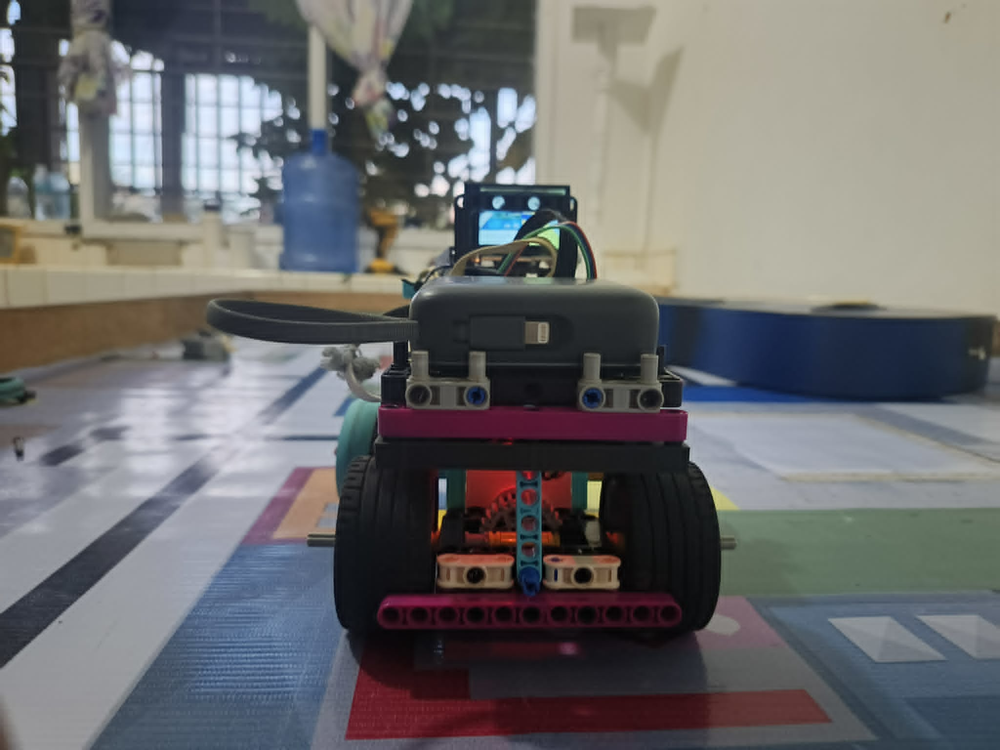
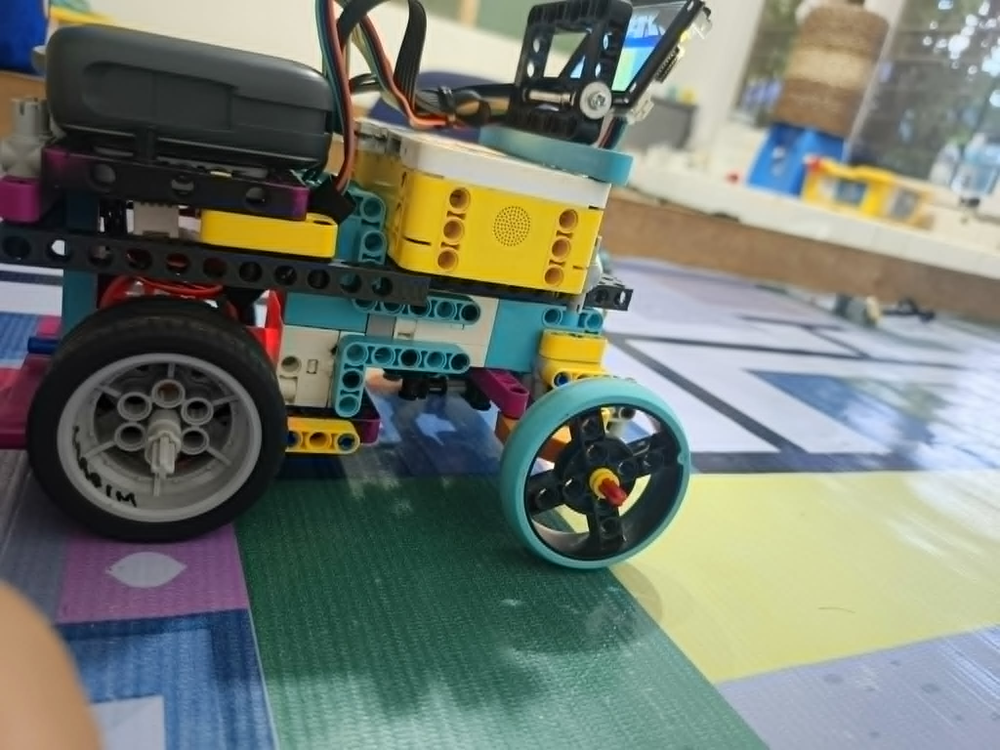
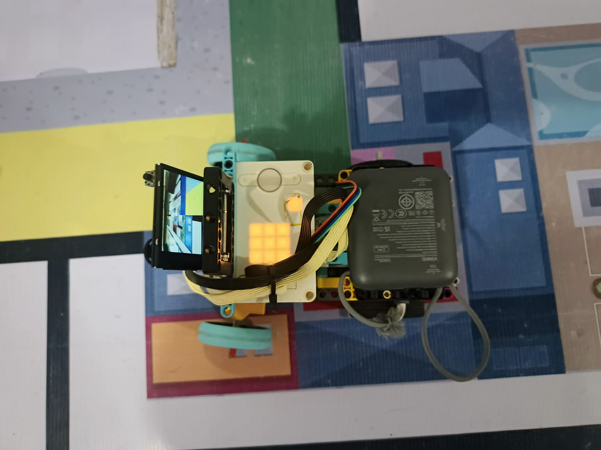

# SJ-Future-Engineers

Welcome to the GitHub Repository of Team Robosenian, competing for the Philippine Robotics Olympiad Future Engineers 2026. The robot is an autonomous, scaled-down vehicle designed to navigate a structured track, avoid obstacles (red and green pillars), and park or change lanes based on visual feedback. The architecture decouples high-level computer vision and path planning from low-level motor actuation and sensor data aggregation.

The autonomous vehicle uses a single SPIKE Prime Large Hub as both the high-level logic controller and low-level actuator driver. The robot navigates an obstacle course using color detection and ultrasonic distance mapping, processing all feedback locally on the hub using the Pybricks.

Steering Mechanism (Ackermann Geometry)
Instead of differential drive (like a tank), the vehicle utilizes Ackermann steering geometry. This ensures that when the robot turns, all wheels trace concentric circles around a single common center point, preventing the tires from slipping sideways.
Actuation: A single spike prime motor is linked to the front steering knuckles via adjustable turnbuckles.
Mechanical Advantage: The steering linkages are configured so that the inner wheel turns at a sharper angle than the outbound wheel during a turn.
Propulsion: A single SPIKE Large Motor drives the rear axle.
Color Sensors: Mounted low to the ground, pointing down at the front to recognize boundary lines (blue/orange), or angled forward to evaluate the color signatures of obstacle pillars (red/green). 
Ultrasonic Sensor: Mounted to the side and front to identify track outer walls or confirm distance to a pillar.

# Members 
-**<p>Ethan Blaire S. De la Piña</p>** 
*<p>Background: Student of San Jose National High School</p>*
<p>Role: Coder, Strategist</p>
Year of Birth: 2009

-**<p>Jay Arnel A. Garcia</p>**
*<p>Background: Student of San Jose National High School</p>*
Role: 3D Printer, Documentator
<p>Year of Birth: 2010</p>

-**<p>Mel Iven M. Pangandoyon</p>**
*<p>Background: Student of San Jose National High School</p>*
Role: Build Designer, Coder
<p>Year of Birth: 2009</p>

-**<p>Nelson T. Ingking</p>**
*<p>Background: Teacher in San Jose National High School</p>*
Role: Team Coach, Guide
<p>Year of Birth: 1985</p>


# Strategies

The strategy we implemented for Open Challenge is that, after the color sensor first detects whether it is orange or blue, it accelerates based on the direction it is moving. For the Obstacle Challenge, our strategy is that after the color sensor detects a line, whether orange or blue, the robot maneuvers itself into the direction it will run, parallel to the wall.

### Mobility Management 

Mobility management governs how our vehicle physically moves, translates software decisions into mechanical force, and maintains structural stability on the track. Our architecture decouples traction control (propulsion) from directional control (steering) to optimize efficiency, torque, and tracking accuracy.
<p>A. Propulsion System (The Drive Motor)Component Selected: SPIKE Large Motor (drive = Motor(Port.C))</p>
<p>Implementation: Mounted longitudinally at the rear of the vehicle, driving the rear axle directly.</p>
<p>Engineering Principles (Torque vs. Speed): The propulsion system requires high starting torque to overcome static friction and rapidly accelerate out of corner turns. The Large Motor provides a superior stall torque (continuous, peaking higher under duty cycle) compared to smaller variants. Because our script commands the motor using raw duty cycle percentages (drive.dc(DCSPEED)), the motor naturally draws more current to provide the necessary torque when encountering resistance, maintaining steady momentum without stalling.</p>
<p>B. Directional Control (The Steering Actuator)Component Selected: SPIKE Medium Servo Motor (steer = Motor(Port.A))</p>
Implementation: Positioned at the front of the vehicle, directly over the front axle assembly.</p>
<p>Engineering Principles (Precision & Speed): Steering requires high rotational speed and precise angular positioning rather than high continuous torque. The Medium Servo features a lower internal gear ratio, allowing it to snap to exact targeted angles (steer.run_target(1000, angle)) at speeds up to 1000 deg/s.</p>
<p>Internal PID Feedback: Both motors utilize embedded optical encoders that track positions with 1 degree resolution. This allows the Pybricks firmware to run internal Proportional-Integral-Derivative (PID) loops, ensuring the steering angles match our software's structural variables precisely, even under the lateral stress of a turn.</p>
<p></p>Vehicle Chassis Design and Geometry. The foundation of our mobility management relies on Ackermann Steering Geometry rather than a differential (tank-style) drive.</p>

**<p>3D PRINTED FILES</p>**
[BASE](models/FE_NEW_BASE.stl)
[L HOLDER](models/NEW_FE_LHOLDERR.stl)
[COVER](models/cover.stl)
[ULTRASONICHOLDER](models/ultrasonicholder36.stl)
### Power and Sense Management

<p>Power and sense management dictate how our vehicle distributes electrical energy to sustain high-performance operations and how it gathers environmental telemetry to safely solve the track challenges. This subsystem ensures that our computational nodes, sensors, and actuators are adequately powered without experiencing voltage drops or signal degradation.</p>

**<p>A. Primary Power: LEGO SPIKE Prime Battery</p>**
<p><strong>Specifications: 7.3V, 21000 mAh</strong>Lithium-Ion rechargeable battery pack housed inside the SPIKE Prime Hub.</p>
<p><strong>Allocation:</strong>Powers the central ARM Cortex-M7 processor, the internal 6-axis IMU, the front steering servo motor, the rear drive motor, the downward color sensor, and the ultrasonic sensor.</p>
<p><strong>Engineering Justification:</strong>The drive motor experiences heavy spikes in inductive current draw during acceleration and rapid reversals. By keeping this high-current draw on its own isolated chemical cell, we eliminate the risk of voltage sags (brownouts) that would reset our microcontrollers.</p>

**<p>B. Secondary Power: Vinko Mini Fast-Charging Power Bank</p>**
<p><strong>Specifications: 10000mAh (or 20000mAh)</strong>capacity featuring built-in smart LED capacity tracking and an integrated Type-C braided cable delivering up to <strong>22.5W max</strong> output power.</p>
<p><strong>Allocation:</strong> Dedicated solely to powering our co-processing vision subsystem: the ESP32 microcontroller and the DFRobot HuskyLens AI camera.</p>

### Open Challenge
Objective: Complete three autonomous laps.

The first problem we experienced was the random internal wall placements. The solution we implemented is that we put ultrasonics on both sides(left and right) of the robot. Another problem was the inconsistent reading of the color sensor. The solution we made was to make sure the sensor's physical environment is stable and maintain a consistent height. The last problem we encountered was that sometimes the build would fall off on its own. The solution for that was to balance the weight distribution of the robot.

### Open Management
Open Challenge management governs how our vehicle navigates a completely clear, obstacle-free track. In this mode, the primary objective is maximizing speed, minimizing lap times, and executing mathematically perfect 90° turns. The strategy focuses heavily on deep sensor synchronization, using the ground color sensor to locate boundary lines and the internal Inertial Measurement Unit (IMU) to lock down straight trajectories.

**Straight-Line Navigation (PD Gyro Control)**
<p>To prevent the vehicle from drifting into track walls over long straightaways, we implemented a Proportional-Derivative (PD) Gyro Control loop inside the do_gyro() function.</p>
<p>The vehicle constantly calculates its heading error by comparing its current absolute compass heading against our software's directional target variable (target).</p>

```python
err  = hub.imu.heading() - target
rate = hub.imu.angular_velocity()[2]
cor  = max(-STEER_LIMIT, min(STEER_LIMIT, KP * err - KR * rate))
steer.run_target(1000, int(STEER_CENTER + cor), wait=False)

```

<p>Proportional Control (KP * err): Quantifies how far off course the vehicle has drifted. We set KP to 3.0, meaning if the car drifts 5° to the left, the steering servo instantly counters by turning the front wheels 15° to the right.</p>

<p>Derivative Control (KR * rate): Measures the vehicle's rotational velocity (how fast it is spinning). We set KR to 0.2. This acts as an automated shock absorber, dampening the steering adjustments as the car approaches its straight heading to prevent erratic fish-tailing or over-correction.</p>

<p>Saturation Guarding: The final correction factor (cor) is bound tightly by STEER_LIMIT (80°) to prevent the code from forcing the motor past its physical end-stops.</p>

**Automated Cornering Strategy (The Race Line)**
<p>The vehicle tracks its progress around the course by using its downward-facing color sensor to recognize bright boundary lines taped to the track floor. When a line is crossed, the car executes a multi-stage turning matrix:</p>

*<p>Stage 1: Line Verification and Race Calibration</p>*
<p>The ground sensor reads the floor data. The functions is_blue() and is_orange() monitor Hue, Saturation, Value, and Reflection simultaneously. Once a line is confirmed, the vehicle ignores all subsequent color changes for a set duration (COOLDOWN_MS = 10000) to guarantee that the same physical line isn't counted twice.</p>

*<p>Stage 2: Frontal Distance Cushioning</p>*
<p>Upon registering a line, the vehicle does not turn immediately. It triggers wait_for_wall(), maintaining its straight gyro line at a controlled DCSPEED (50%) until the front ultrasonic sensor confirms that the vehicle is within 100 mm(WALL_TURN_MM) of the corner wall. This ensures the vehicle maximizes its deep entry into the corner before breaking away.</p>

*<p>Stage 3: Gyro Target Re-mapping</p>
<p>Once the spatial cushion is met, the code modifies our global absolute reference frame by precisely 90°:</p>

```python
if tdir == 'blue':
    target -= 90      # Adjust heading target for a sharp Left Turn
    direction = 1
else:
    target += 90      # Adjust heading target for a sharp Right Turn
    direction = 2

```

*<p>Stage 4: High-Torque Pivot Reversal</p>
<p>The vehicle cranks its front steering servo completely to its outer edge (TURN_STEER = 80). The main loop is temporarily suspended, and the rear drive motor runs in high-velocity reverse power (drive.run(-600)).</p>
<p>The vehicle swings its rear end around, pivoting into the corner. The internal IMU samples the rotation at a hardware level. The moment the gyro sensor registers that the vehicle's body has aligned within a tight 5° tolerance window (GYRO_ALIGN_TOL) of our new target heading, the reverse power cuts out, the steering assembly straightens back to 0°, </p>

### Obstacle Challenge 
Objective: Complete three laps with a traffic sign aligned with its direction.

The first problem we experienced was fixing the traffic sign compliance. The solution for that was to put a Husky Lens Camera that can be connected to an LMS. The second was the inconsistent detection of traffic lights from the camera. The solution was to put the camera at the back for a wider field of view. We also implemented a gyro for precise straight movement, maintaining angular velocity, and allowing a robot to track its rotation.

### Obstacle Management

Obstacle management defines how our vehicle identifies, evaluates, and evades hazards on the track in real time. For SJ-Future-Engineers, this system is divided into two distinct protective layers: Computer Vision Pillar Evasion (high-level path modifications handled via the camera) and the Ultrasonic Collision Buffer (low-level emergency braking handled via acoustic ranging).

High-Level Obstacle Evasion (The AI Vision Pipeline)
The primary tool for managing colored pillars (red and green blocks) is our machine learning co-processing subsystem, which is the LMS.

<p>A. Target Classification and Filtering.</p> 
<p>The HuskyLens camera constantly streams a 6-integer telemetry array to the SPIKE Prime Hub. The hub instantly processes these variables through a series of logical validation steps:</p>
<p>Color Identification: The function classify_block() translates the camera's raw signature ID (cid) into descriptive 'green' or 'red' text strings.</p>
<p>Dual-Target Arbitration: If both a red and a green pillar appear in the frame simultaneously, the main execution loop compares their bounding-box widths (green_w and red_w). The program prioritizes whichever block has the larger width, as a wider pixel profile indicates it is physically closer and poses the immediate structural threat.</p>
<p>Lock Acquisition: Once a dominant block is identified within a critical distance boundary (block_y > 50), the system triggers a software lock (locked_block). This lock prevents the car from switching target strategies midway through a turn if a second color flashes into view.</p>
<p>B. Spatial Zoning Matrices</p>
<p>The script partitions the camera’s 320 x 240 pixel viewing window into a coordinate grid to evaluate threats:</p>
<p>The X-Axis (Horizontal Positioning): Evaluated by classify_block_x(). It maps where the obstacle sits relative to our centerline.</p>
<p>The Y-Axis (Proximity Depth): Evaluated by classify_block_y(). A value of cy > 50 indicates the vehicle has breached the safe approach threshold.</p>
<p>The Width Profile (Size Verification): Evaluated by classify_block_width(). A pixel width value of cw >=11 triggers an "emergency" classification, proving the object is an actual roadblock and not a distant background color glitch.</p>

**<p>C. Evasion Trajectory Execution</p>**
<p>When detect_block() reports that a block is "near" and its size is an "emergency", the vehicle breaks away from its straight gyro line and enters the turn_to_ok() evasion routing:</p>

```python
if block_color == 'green':
    ok_zone    = 'g_kinda_ok'  # Safe escape corridor (cx: 64-128)
    wiggle_dir = 25            # Hard steer right
else:
    ok_zone    = 'r_kinda_ok'  # Safe escape corridor (cx: 64-128)
    wiggle_dir = -25           # Hard steer left

```
The vehicle suspends its standard gyro tracking algorithm and turns its steering knuckles exactly $25^\circ$ in the opposite direction of the block's identity—steering right to clear green pillars and steering **left to clear red pillars**.
<p>The car maintains this evasive curve until the camera feed updates and confirms that the block's horizontal coordinate (bx) has shifted completely into the safe peripheral flank zone (ok_zone). Once cleared, the wheel center, old tracking flags reset, and the background gyro control takes back control of straight-line navigation.</p>

**<p>3.3 Low-Level Collision Buffering (The Ultrasonic Safety Net)</p>**
<p>If an obstacle is missed by the camera (due to extreme glare, dark shadows, or an unlearned color profile), or if the vehicle approaches a solid track wall head-on, our low-level sensor array takes over.</p>
<p>The front-facing ultrasonic sensor (ultra) acts as an automated safety brake. It measures the physical distance to objects directly ahead by bouncing high-frequency sound waves off surfaces.</p>

```python 
if brake_on and df < ULTRA_FRONT_MM:
    emergency_reverse()

```
                     
<p>If the distance to a solid surface drops below 50 mm (ULTRA_FRONT_MM), the program stops processing normal track loops and fires emergency_reverse(). This routine drops the propulsion system into reverse power (-600) and backs up for exactly 1000 ms while centering the steering mechanism. This creates a spatial cushion, allowing the vehicle to reset its orientation and avoid an impact that could damage its front chassis or steering linkage geometry.</p>

# Modules

pybricks.hubs (PrimeHub): The core library for the main vehicle controller. It manages internal electronics like the 6-axis Inertial Measurement Unit (IMU/Gyro), built-in speaker, status LED matrix, and battery management.

pybricks.pupdevices (Motor, ColorSensor, UltrasonicSensor): The hardware abstraction layer for LEGO Powered Up (PUP) peripherals. It contains built-in feedback control systems (PID loops), allowing the code to command precise angles, tracking speeds, and distances.

pybricks.parameters (Color, Port): A configuration module containing constants that define the physical layout of the hub (e.g., ports A through E) and primitive colors for the LED light.

pybricks.tools (wait, StopWatch): The time-management module. wait() yields CPU control for safe scheduling, while StopWatch() implements software timers used heavily in your code for cooldowns and emergency reverse durations.

pupremote_hub (PUPRemoteHub): A communication protocol module. It enables the LEGO Hub to communicate via UART serial communication over a standard sensor port to an external microcontroller (in your case, an ESP32 running a HuskyLens AI camera).
### Electromechanical Hardware Mapping

| Component Instance | Physical Hardware Component | Vehicle Subsystem | Software Interaction & Functionality |
| :--- | :--- | :--- | :--- |
| **`hub = PrimeHub()`** | LEGO SPIKE Prime Brick / Hub | Central Controller & IMU | Processing unit. Uses internal **6-axis Gyro** via `hub.imu.heading()` to keep the vehicle straight. Controls built-in status lights and speaker beeps. |
| **`steer = Motor(Port.A)`** | LEGO Powered Up Servo Motor | Steering Actuator | Connected to front wheels. Uses internal optical encoders to turn wheels to exact structural angles (`STEER_CENTER`, `SIDE_WALL_NUDGE_STEER`). |
| **`drive = Motor(Port.C)`** | LEGO Powered Up Large Motor | Propulsion System | Connected to drive axles. Commanded via direct motor power duty-cycles (`drive.dc(DCSPEED)`) or regulated velocity track speeds (`drive.run()`). |
| **`color = ColorSensor(Port.E)`** | LEGO Color Sensor | Downward Lap Sensor | Pointed at track floor. Measures Hue, Saturation, Value, and raw reflection variables to flag down-track Blue/Orange boundary lap lines. |
| **`ultra = UltrasonicSensor(Port.D)`** | LEGO Ultrasonic Distance Sensor | Front Collision Buffer | Emits acoustic sound waves straight ahead. Evaluates buffer zone distance (`front_dist()`). Triggers emergency braking routines if wall distance drops below 50mm. |
| **`lms = PUPRemoteHub(Port.B)`** | ESP32 MCU + HuskyLens AI Camera | Vision & Side-Telemetry | Communicates via a serial UART bridge. Translates object bounding boxes (`cx`, `cy`, `cw`) and side-wall ToF sensor distances into raw system data arrays. |

### The Process to Build, Compile, and Upload the Code

We ensure that our LEGO Prime Hub has the  Pybricks Firmware installed. We have a Pybricks Code installed on our laptops. With this, we can now upload our code to the SPIKE Prime Hub and have the robot complete the open and obstacle challenges. When we click the green Play icon inside the Pybricks IDE, the deployment pipeline executes an automated process instantly. First, the browser IDE handles syntactic verification by parsing our code to catch structural Python syntax errors or unmapped variables before deployment. Next, bytecode compilation takes over to instantly compress the raw MicroPython script into an optimized, lightweight binary representation called a .mpy file. Finally, a stream upload sends this compiled bytecode directly over our active Bluetooth Low Energy or USB-C connection into the volatile RAM of the LEGO Prime Hub controller, initializing the vehicle for immediate execution.

# Pictures -Team and vehicle 

### Team Photos

**<p>Fun Photo</p>**




**<p>Team Photo</p>**


<p>Official Team Photo</p>

### Vehicle Photos

**<p>Bottom View</p>**



**<p>Front View</p>**



**<p>Left View</p>**



**<p>Rear View</p>**



**<p>Right View</p>**



**<p>Top View</p>**



More description on 't-photos' subfolder.

# Video

**<p>Videos</p>**

[](https://youtu.be/iB-URkR1FVM)

<a href="https://www.youtube.com/watch?v=iB-URkR1FVM">Youtube Link</a>

-<strong>Obstacle Challenge</strong>
    [](https://youtu.be/drb0f370XIs)

<a href="https://www.youtube.com/watch?v=drb0f370XIs">Youtube Link</a>

YouTube links are accessible. For more information, please look at the video subfolder.


