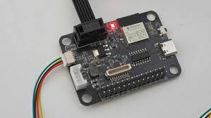
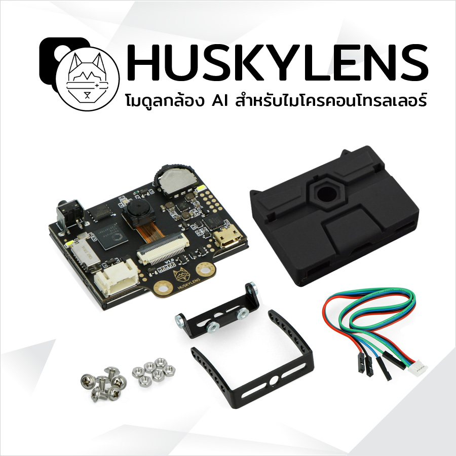
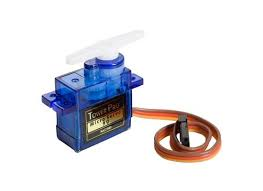
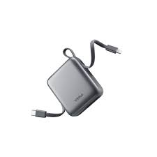

# Materials Used

<strong>LMS</strong>

We used LMS to connect the Servo Motor and Husky Lens Camera to SPIKE.

<strong>Husky Lens Camera</strong>

A camera used to detect blocks and their color.

<strong>Servo Motor</strong>

The servo motor is used for moving the camera left and right.

<strong> Power Bank </strong>

The main power supply is used to run the robot.

All other materials are from LEGO Education Spike.
